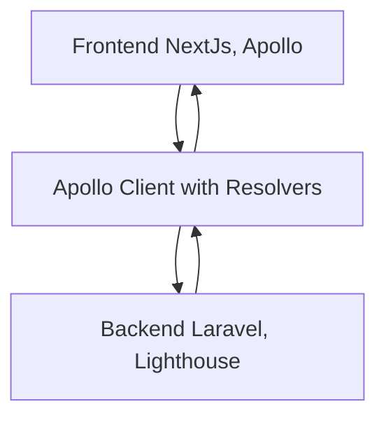
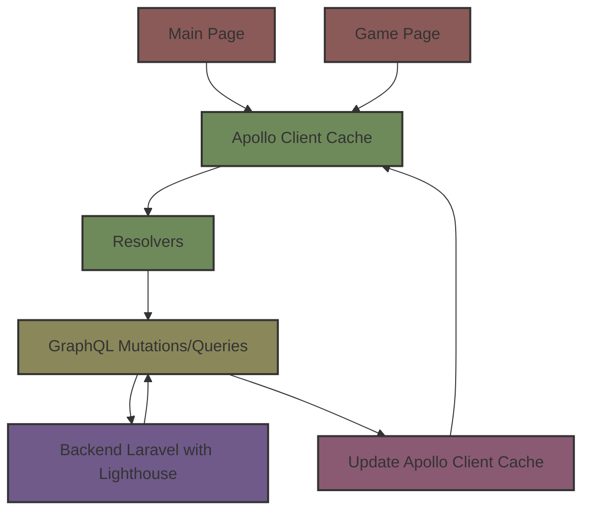

# Memo Test Game Architecture

The Memo Test Game is a card-matching game built with a combination of modern web technologies. This document provides an overview of the project's architecture and how different components interact with each other.

## Overview

The project is divided into two main parts:

1. **Backend**: Built with Laravel and Lighthouse, it provides a GraphQL server for the frontend to interact with.
2. **Frontend**: Developed using NextJs and Apollo, it provides the user interface and interacts with the backend using GraphQL queries and mutations.

## Backend Architecture

### Laravel with Lighthouse

Laravel, a popular PHP framework, is used to structure the backend. Lighthouse, a GraphQL server for Laravel, is used to expose a GraphQL API.

#### Key Components:

- **Models**: Represent the data structure and relationships. Key models include `Game` and `User`.
- **GraphQL**: Contains the GraphQL queries and mutations. The `GameQuery` and `GameMutator` handle the game-related operations.

## Frontend Architecture

### NextJs with Apollo

NextJs provides a React framework for server-rendered applications. Apollo Client is used to interact with the GraphQL server.

#### Key Components:

- **Pages**: Contains the main pages of the application. The `game.tsx` is the primary interface for the game.
- **Components**: Reusable UI components like `Card`, `FormStart`, `Game`, and `Scoreboard`.
- **Lib**: Contains the logic for interacting with the GraphQL server and managing the local state.

### Apollo Client with Resolvers

Apollo Client is used to manage both the remote data from the GraphQL server and the local state. Resolvers in Apollo Client allow for combining operations for both the client and the network.

For example, when saving the game, the frontend uses `useMutation(saveScore)`. This triggers a `@client` query, which calls the resolver. The resolver then calls a mutation to the server and updates the cache.

Since the Main page and Game page are rendered separately without an `_app.tsx`, separate instances of the local state (cache) exist. This separation necessitates data saving when transitioning from one page to another.

## Diagrams

Relationship backend-frontend

Frontend flow

## Conclusion

The Memo Test Game's architecture is modular and scalable, making use of modern web technologies. The combination of Laravel with Lighthouse on the backend and NextJs with Apollo on the frontend provides a robust platform for the game's functionality.

